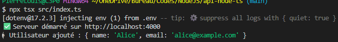
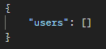

# API NodeJS

## Installation
Clonez le projet : ```git clone https://github.com/Plouis-Dnx/NodeJS.git``` \
Déplacez-vous dans le dossier NodeJS/api-node-ts \
Dans votre terminal, installez les paquets manquants : \
```npm install ...``` :
 - express
 - dotenv
 - -D typescript ts-node @types/node @types/express nodemon

## Lancement
Lancez le serveur avec ```npm run dev``` \
Vous devriez voir quelque chose comme : 


## Description des Routes
```/``` retourne un message "API Node.js avec TypeScript fonctionne !" \
```/users``` retourne la liste des utilisateurs

## Tests et Démonstrations
### Console


### Postman
GET http://localhost:4000/ \
 

GET http://localhost:4000/users : \
 

POST http://localhost:4000/users \
